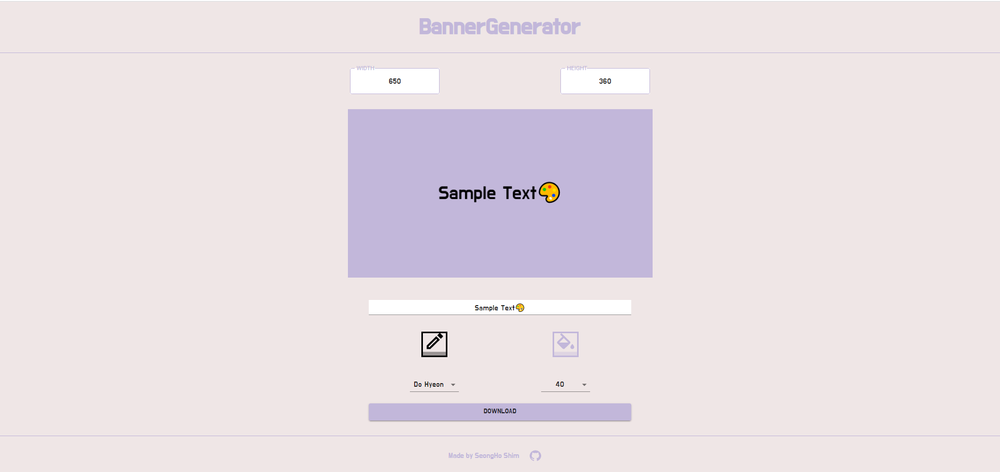

# BannerGenerator

React를 이용해서 Velog 같은 곳에서 사용할 수 있는 Banner를 만들 수 있는 웹 앱

* React
* Material UI + Styled-Component
  * Material UI 사용 연습
* Figma로 프로토타이핑

## 프로토타이핑
프로젝트를 만들기 전에 먼저 **Figma** 를 사용해서 전체적인 프로토타이핑을 하였다. **Figma**를 사용하는 것이 이번이 처음이라 간단하게만 만들었다.

[Figma](https://www.figma.com/file/6Zw2wvZwwoxJipNAGP5FNr/Banner-Generator)

## 스크린샷
|              메인화면 - 데스크탑          |              메인화면 - 모바일            |
| ---------------------------------------- | ---------------------------------------- |
| | |

## 기술 스택
* React
* Styled-Component + Material UI
* Figma

## 프로젝트를 하며 배운 지식
* Material UI를 사용하는 방법
* Figma를 사용하는 방법
* Context API를 사용해서 상태 관리하는 방법